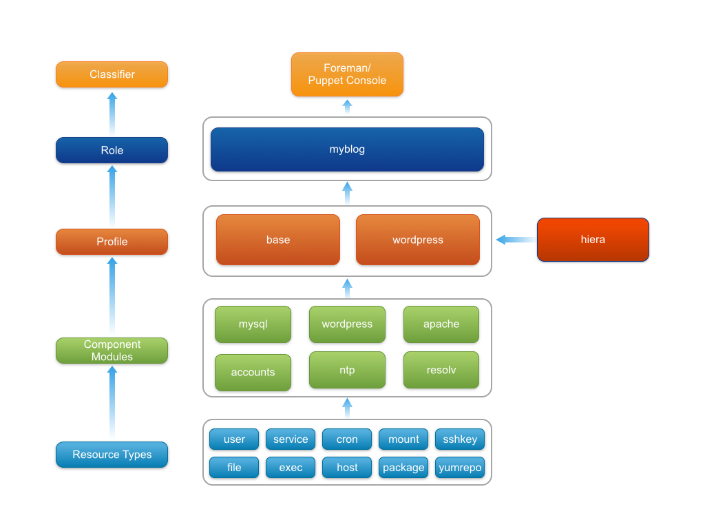

#Roles and Profiles Pattern (Methodology)

##Overview

Provides a methodology for abstraction of Puppet code.

It's all about **abstraction**:

- Data (parameters) gets abstracted by **Hiera**
- Providers/Resources abstract the underlying OS implementation
- Providers get abstracted by **Types**
- Resources get abstracted by **Classes**
- Classes get abstracted by **Modules** (**Component Modules**)
- Modules get abstracted by **Profiles**
- Profiles get abstracted by **Roles**

####Classification/Abstraction Flow:

1. A node is assigned a **Role**
1. A **Role** includes one or more **Profiles**
1. **Profiles** include **Component** modules, **Resources** combined with logic.
  1. Make calls out to **Hiera** for hierarchal specific data (parameters)
  1. Hiera data is passed to **Component** modules
1. **Component** modules call Puppet **Resources**
1. Puppet **Resources** use **Types**/**Providers** to configure setting on a node



##Profiles

Combines modules andresources to define a logical technology stack(single).

For more detail consult the documented set of [guidelines](profile_guidelines.md)

Profiles follow the following rules:

- Technology specific
- May include [resources](https://docs.puppetlabs.com/references/stable/type.html) directly
- May make calls to Hiera for required data (parameters)
    - These calls may be transparent via [automatic parameter lookup](https://docs.puppetlabs.com/hiera/1/puppet.html#automatic-parameter-lookup)
- Include **Component** module classes/resources
- Named according to the technology they manage
    - Do **NOT** include environments in profile nawmes

Being technology specific does not limit the profile to managing a single application.  It should include all applications and logic need to fully manage an application stack.

Example:

````
class profile::wordpress {

  ## Hiera lookups
  $site_name               = hiera('profiles::wordpress::site_name')
  $wordpress_user_password = hiera('profiles::wordpress::wordpress_user_password')
  $mysql_root_password     = hiera('profiles::wordpress::mysql_root_password')
  $wordpress_db_host       = hiera('profiles::wordpress::wordpress_db_host')
  $wordpress_db_name       = hiera('profiles::wordpress::wordpress_db_name')
  $wordpress_db_password   = hiera('profiles::wordpress::wordpress_db_password')
  $wordpress_user          = hiera('profiles::wordpress::wordpress_user')
  $wordpress_group         = hiera('profiles::wordpress::wordpress_group')
  $wordpress_docroot       = hiera('profiles::wordpress::wordpress_docroot')
  $wordpress_port          = hiera('profiles::wordpress::wordpress_port')

  ## Create user
  group { 'wordpress':
    ensure => present,
    name   => $wordpress_group,
  }
  user { 'wordpress':
    ensure   => present,
    gid      => $wordpress_group,
    password => $wordpress_user_password,
    name     => $wordpress_group,
    home     => $wordpress_docroot,
  }

  ## Configure mysql
  class { 'mysql::server':
    root_password => $mysql_root_password,
  }

  class { 'mysql::bindings':
    php_enable => true,
  }

  ## Configure apache
  include apache
  include apache::mod::php
  apache::vhost { $::fqdn:
    port    => $wordpress_port,
    docroot => $wordpress_docroot,
  }

  ## Configure wordpress
  class { '::wordpress':
    install_dir => $wordpress_docroot,
    db_name     => $wordpress_db_name,
    db_host     => $wordpress_db_host,
    db_password => $wordpress_db_password,
  }
}
````

##Roles

A unquie collection (wrapper) of one or more profiles (technology stacks) to define a node

For more detail consult the documented set of [guidelines](role_guidelines.md)

Roles follow the following rules:

- Maps technology to a node
- Nodes get classified with only a **SINGLE** role
    - A **role** similar, yet different, from another role is: a **NEW** **role**.
- Do **NOT** include logic
- ONLY use **includes** for abstracting profiles
- Named according to the nodes purpose (business logic)

Example:

Includes the profile **wordpress** to install/configure wordpress and includes the **base** profile to configure globally common settings such as NTP and default user accounts.

````
class role::myblog {
  include profile::wordpress
  include profile::base
}
````

##References

[Puppet Camp 2013 Presentation](https://puppetlabs.com/presentations/designing-puppet-rolesprofiles-pattern)
[Puppet Roles and Profiles Workflow (SH*% Gary Says)](http://garylarizza.com/blog/2014/02/17/puppet-workflow-part-2/)
